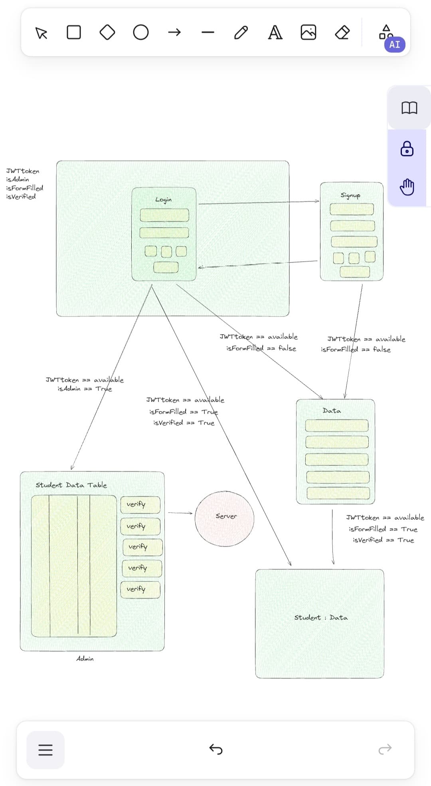

# Internship Log  

December 2024

Day 1 (23-12-24)

Met the employees and got to know the team leads and their respective tasks. There wasn’t much work for me on the first day. I familiarized myself with the projects they were working on and discussed my strengths with the team. They assessed which team or project I might be suitable for. I was assigned a task to implement API CRUD operations for a student management system.

Day 2 (24-12-24)

Worked on the Student CRUD task. Added API calls to `/crud/` for creating a student, deleting a student, updating student data, and reading a list of students with all their details.

Day 3 (25-12-24)

**Holiday**

Day 4 (26-12-24)

Hosted the frontend and backend separately on Azure using Azure Function App and Azure Static Web App. Configured the API calls with CORS settings. Faced issues with the backend not allowing PATCH requests, which caused problems with update calls.

Day 5 (27-12-24)

Integrated the student list data into a `react-data-table-component`. Added functionality for searching and sorting the data by name, role, age, and email. Updated the UI for the student data table using the selected color palette.

Day 6 (28-12-24)

**Holiday**

Day 7 (29-12-24)

**Holiday**

Day 8 (30-12-24)

Hosted the application with the new UI and populated it with 4,400 dummy student records generated through API calls using a JavaScript script executed with Node.js. Tested the sorting and searching functionalities.

Day 9 (31-12-24)

Presented the project to the team lead. Received feedback to add backend validation for the data and a frontend UI to display errors and success messages. Started working on these tasks.

January 2025

Day 10 (01-01-25)

**Holiday**

Day 11 (02-01-25)

Implemented backend validation for the following:
- Age must be a number.
- Name must be a string.
- Role must be a string.
- Email must match a specific format using regular expressions.

Day 12 (03-01-25)

Enhanced the frontend UI using `react-toastify` to display success and error messages. Added error handling for scenarios such as duplicate email, invalid age (non-numeric), invalid name (non-string), and incorrectly formatted email.

Day 13 (04-01-25)

**Holiday**

Day 14 (05-01-25)

**Holiday**

Day 15 (06-01-25)

Deployed the application again using GitHub YML files to Azure. Tested the `react-toastify` notifications and backend validation. Demonstrated the project to the team lead and asked for feedback.

Day 16 (07-01-25)

Created a backend for user login functionality and tested it by hosting on Azure. Presented it to the team lead for feedback.

Day 17 (08-01-25)

Tested login functionality without a password and with credentials for users. Created separate roles for admin and user access.

Day 18 (09-01-25)

Created a data flow diagram for authentication and show it to team lead.

Day 19 (10-01-25)

 Added variables `isFormFilled`, `isFormValidated`, and `Token` to validate student accounts. Implemented functionality to ensure only admins can validate and allow students to update their accounts. Tested on Azure and demonstrated to the team lead.

Day 20 (11-01-25)

**Holiday**

Day 21 (12-01-25)

**Holiday**

Day 22 (13-01-25)

Developed a routing system where routes are accessible based on active variables (`isFormFilled`, `isFormValidated`, etc.). Tested by hosting on Azure and presenting to the team lead.

Day 23 (14-01-25)

**Holiday**

Day 24 (15-01-25)

**Holiday**

Day 25 (16-01-25)

Added password-protected login functionality using NodeMailer for OTP verification. Separated routes and improved security measures. Hosted and tested on Azure. Showed the results to the team lead. 

Day 26 (17-01-25)

Integrated NodeMailer functionality to send OTP for secure login. Tested various use cases, including expired OTPs and incorrect emails, by hosting on Azure and demonstrating to the team lead

Day 27 (18-01-25)

**Holiday**

Day 28 (19-01-25)

**Holiday**

Day 29 (20-01-25)

Enhanced login security by separating admin and user routes and ensuring restricted access to sensitive functionalities. Tested by hosting on Azure.

Day 30 (21-01-25)

Optimized and refactored the backend code for the login and validation system. Added tests for edge cases. Hosted on Azure and demonstrated improvements to the team lead.

Day 31 (22-01-25)

Debugged and resolved minor issues in the OTP-based login functionality. Improved error handling for failed API calls and incorrect user inputs.

Day 32 (23-01-25)

Added frontend UI feedback for invalid OTPs and incorrect email formats using react-toastify. Tested integration thoroughly on Azure.

Day 33 (24-01-25)

mproved admin routes to allow bulk validation of student accounts. Tested by simulating high-traffic scenarios on Azure.

Day 34 (25-01-25)

**Holiday**

Day 35 (26-01-25)

**Holiday**

Day 36 (27-01-25)

Fixed issues with the student update functionality. Verified changes and tested compatibility with backend validation logic.

Day 37 (28-01-25)

Implemented additional backend security checks for OTP validity duration and enhanced error logging.

Day 38 (29-01-25)

Improved UI responsiveness for mobile devices, especially for login and validation pages. Tested cross-browser compatibility. 

Day 39 (30-01-25)

Streamlined the deployment process by automating Azure deployments through GitHub Actions. Tested the pipeline end-to-end.

Day 40 (31-01-25)

Fixed edge cases in the routing logic to handle scenarios where variables like `isFormFilled` and `isFormValidated` are undefined or null.

February 2025

Day 41 (01-02-25)

**Holiday**

Day 42 (02-02-25)

**Holiday**

Day 43 (03-02-25)

Conducted a final round of testing and documentation for the login, validation, and routing functionalities. Prepared for a project review. 

Day 44 (04-02-25)

Day 45 (05-02-25)

Day 46 (06-02-25)

Day 47 (07-02-25)

Day 48 (08-02-25)

**Holiday**

Day 49 (09-02-25)

**Holiday**

Day 50 (10-02-25)

Day 51 (11-02-25)

Day 52 (12-02-25)

Day 53 (13-02-25)

Day 54 (14-02-25)

Day 55 (15-02-25)

**Holiday**

Day 56 (16-02-25)

**Holiday**

Day 57 (17-02-25)

Day 58 (18-02-25)

Day 59 (19-02-25)

Day 60 (20-02-25)

Day 61 (21-02-25)

Day 62 (22-02-25)

Day 63 (23-02-25)

Day 64 (24-02-25)

Day 65 (25-02-25)

Day 66 (26-02-25)

Day 67 (27-02-25)

Day 68 (28-02-25)

March 2025

Day 69 (01-03-25)

Day 70 (02-03-25)

Day 71 (03-03-25)

Day 72 (04-03-25)

Day 73 (05-03-25)

Day 74 (06-03-25)

Day 75 (07-03-25)

Day 76 (08-03-25)

Day 77 (09-03-25)

Day 78 (10-03-25)

Day 79 (11-03-25)

Day 80 (12-03-25)

Day 81 (13-03-25)

Day 82 (14-03-25)

Day 83 (15-03-25)

Day 84 (16-03-25)

Day 85 (17-03-25)

Day 86 (18-03-25)

Day 87 (19-03-25)

Day 88 (20-03-25)

Day 89 (21-03-25)

Day 90 (22-03-25)

Day 91 (23-03-25)

Day 92 (24-03-25)

Day 93 (25-03-25)

Day 94 (26-03-25)

Day 95 (27-03-25)

Day 96 (28-03-25)

Day 97 (29-03-25)

Day 98 (30-03-25)

Day 99 (31-03-25)

April 2025

Day 100 (01-04-25)

Day 101 (02-04-25)

Day 102 (03-04-25)

Day 103 (04-04-25)

Day 104 (05-04-25)

Day 105 (06-04-25)

Day 106 (07-04-25)

Day 107 (08-04-25)

Day 108 (09-04-25)

Day 109 (10-04-25)

Day 110 (11-04-25)

Day 111 (12-04-25)

Day 112 (13-04-25)

Day 113 (14-04-25)

Day 114 (15-04-25)

Day 115 (16-04-25)

Day 116 (17-04-25)

Day 117 (18-04-25)

Day 118 (19-04-25)

Day 119 (20-04-25)

Day 120 (21-04-25)

